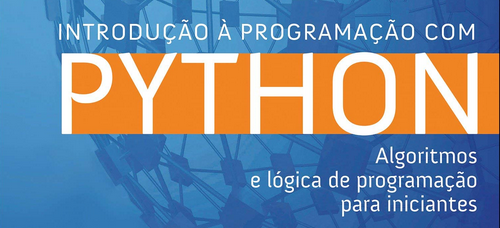

# 

<h1 align="center">
  
</h1>

<h1 align="center">Introduction to Programming</h1>

## Description

- Present the first contact with programming logic;
- Learn to use an integrated development environment;
- Learn debugging techniques;
- Learn to use a programming language.

> 1st Unit:

- Indentation, First program and comments;
- Variables, Assignment and Primitive Data Types;
- Primitive data types (String)
- Decision Making Structure (IF, ELSE, ELIF) and Relational Operators
- Repetition structure (While / counters and accumulators);
- Repetition Structure (Nesting / Interrupting Repetition);
- List and Tuple;
- Dictionaries;
- [Evaluation of the 1st Unit](https://github.com/thiagomvilela/introduction-to-programming/tree/main/05%20Evaluation%20-%201st%20Unit)

> List of programming exercises in Python language from the Faculty of Computing (FACOM) of the Federal University of Uberlândia (UFU):

- Exercises: Variables and Expressions;
- Exercises: Strings;
- Exercises: Conditional Statements;
- Exercises: Repetition Commands.

> 2nd Unit:
- Agenda and Force Project;
- Functions (Defining a function / Local and Global Variables, Recursion);
- Module Functions / Tips;
- Modules and Packages;
- Files;
- [Project development of the 2nd unit: CBIC Calculator](https://github.com/thiagomvilela/cbic-calculator)

### 🛠 Technologies

The following tools were used in the construction of the project:

- [Python](https://www.python.org/)
- [PyCharm](https://www.jetbrains.com/pt-br/pycharm/)
- [Visual Studio Code](https://code.visualstudio.com/)
- [Introduction to Programming with Python](https://python.nilo.pro.br/)
